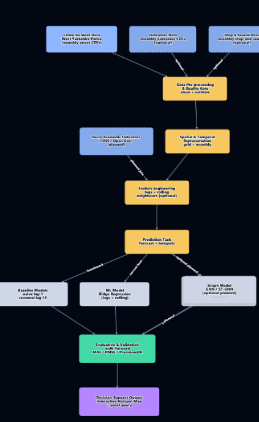

# Crime Hotspot Prediction System
### West Yorkshire Police · COS-5031-E Discipline-Specific AI Project

> **Hotspot prediction is a risk signal, not certainty.**
> This is a forecasting and ranking system, not a prediction of individual behaviour.
> The system is advisory only. Human officers retain all decision-making authority.

---

## Table of Contents

1. [Project Overview](#1-project-overview)
2. [Business Case and Problem Statement](#2-business-case-and-problem-statement)
3. [Project Charter (PID Summary)](#3-project-charter-pid-summary)
4. [Dataset](#4-dataset)
5. [Repository Structure](#5-repository-structure)
6. [Pipeline Architecture](#6-pipeline-architecture)
7. [Models and Results](#7-models-and-results)
8. [How to Run](#8-how-to-run)
9. [Dashboard and API](#9-dashboard-and-api)
10. [Ethical Framework (FAST Principles)](#10-ethical-framework-fast-principles)
11. [Project Management](#11-project-management)
12. [Team and Roles](#12-team-and-roles)
13. [Academic Context](#13-academic-context)
14. [Known Limitations](#14-known-limitations)
15. [Licence and Reuse](#15-licence-and-reuse)

---

## 1. Project Overview

This repository contains the full end-to-end pipeline for a **crime hotspot forecasting system** built for West Yorkshire Police as part of a Discipline-Specific AI project at the University of Bradford (COS-5031-E, Level 5, 60 credits).

The system ingests publicly available crime data from [data.police.uk](https://data.police.uk), aggregates it onto a 500m spatial grid, engineers temporal and spatial features, and trains two families of models:

- **Ridge Regression** (primary operational model - interpretable, auditable)
- **CNN-GRU** (deep learning benchmark - higher accuracy, lower interpretability)

The outputs are served via a **FastAPI backend** and a **Leaflet.js interactive map** that allows officers to query hotspot probability scores by grid cell, date range, and crime type.

Live demo: [https://ourworkflow.netlify.app/crime-map/](https://ourworkflow.netlify.app/crime-map/)
API: [https://crime-prediction-apii.onrender.com](https://crime-prediction-apii.onrender.com)

---

## 2. Business Case and Problem Statement

**Domain:** Law enforcement and public safety, West Yorkshire, UK

**Problem:** Reactive policing is resource-intensive and insufficient for preventing crime in high-density urban areas. West Yorkshire Police need a data-driven decision support tool that can rank geographic cells by predicted crime likelihood one month ahead, enabling proactive patrol allocation.

**Scope:**
- Geographic area: West Yorkshire (Bradford, Leeds, Calderdale, Kirklees, Wakefield)
- Time range of training data: January 2018 to January 2024
- Forecast horizon: 1 month ahead
- Grid resolution: 500m x 500m cells

**Key constraints:**
- System must be explainable under ICO AI and Data Protection Guidance
- No automated enforcement; a human officer must remain in the loop (UK GDPR Article 22)
- No individual-level PII at any stage of the pipeline
- Must run on standard university-grade infrastructure

---

## 3. Project Charter (PID Summary)

| Field | Detail |
|---|---|
| **Project Title** | Crime Hotspot Prediction System |
| **Client** | West Yorkshire Police (DSP client project) |
| **Module** | COS-5031-E Discipline-Specific AI Project |
| **Module Leader** | Dr Kulvinder Panesar |
| **Client Supervisor** | Dr Irfan Mehmood |
| **Organisation (fictional)** | Future AI for ALL (FALL) |
| **Project Manager** | Alaedine Ait Bella |
| **Jira Board** | CP (Crime Prediction) |
| **Methodology** | Agile (Scrum, sprint-based) |
| **Sprints** | 5 sprints across 2 semesters |
| **Group Canvas Submission Deadline** | Friday 17th April 2026 by 12pm |
| **Client Presentation Date** | Monday 20th April 2026, Room D.1.03 |

**Aims and Objectives:**

1. Explore existing crime prediction methods and relevant literature
2. Source, clean, and engineer features from the West Yorkshire crime dataset (data.police.uk)
3. Build and evaluate baseline and advanced forecasting models
4. Develop an interactive crime hotspot dashboard for operational use
5. Ensure the solution meets ethical, legal, and responsible AI requirements
6. Document all decisions for auditability and reproducibility

**Outcomes:**
- Trained Ridge Regression and CNN-GRU models with walk-forward validation logs
- Interactive Leaflet map dashboard with FastAPI backend
- Full open-source pipeline on GitHub

**Stakeholders:**
- West Yorkshire Police (primary client)
- COS-5031-E module team (academic client)
- General public (indirect, affected by patrol allocation decisions)

---

## 4. Dataset

**Source:** [https://data.police.uk](https://data.police.uk) (open licence)

**Coverage:** December 2022 to November 2025, West Yorkshire

**Size:** 1,048,575 rows x 12 columns (.csv format)

**Columns:**

| Column | Type | Notes |
|---|---|---|
| `Crime ID` | string | Unique identifier (sparse) |
| `Month` | string | Format: YYYY-MM |
| `Reported by` | string | Always "West Yorkshire Police" |
| `Falls within` | string | Force area |
| `Longitude` | float64 | WGS84 |
| `Latitude` | float64 | WGS84 |
| `Location` | string | Nearest street / premises |
| `LSOA code` | string | Lower Super Output Area |
| `LSOA name` | string | District-level label |
| `Crime type` | string | 14 categories |
| `Last outcome category` | string | Investigation status |
| `Context` | string | Excluded (97% null) |

**Download instructions:**

The dataset is not included in this repository due to file size. To reproduce results:

1. Go to [https://data.police.uk/data/](https://data.police.uk/data/)
2. Select **West Yorkshire** under "Forces"
3. Select date range **December 2022 to November 2025**
4. Click **Generate File** and download the archive
5. Extract all `.csv` files into `data/raw/`

---

## 5. Repository Structure

```
crime-prediction-/
│
├── data/                            # Crime data (raw CSVs not committed due to size)
│   ├── raw/                         # Downloaded street-level CSVs from data.police.uk
│   └── processed/                   # Generated parquet files (cell_month_features, dim_cell)
│
├── src/                             # Core ML pipeline scripts
│   ├── config.py                    # Shared configuration, paths, grid settings
│   ├── utils.py                     # Shared utility functions (metrics, helpers)
│   ├── make_dataset.py              # Load CSVs, snap to 500m grid, build lag features
│   ├── make_month_panels.py         # Monthly panel construction per crime type
│   ├── baseline.py                  # Lag-1 and Lag-12 naive baseline models
│   ├── walk_forward.py              # Walk-forward validation loop (Ridge + baselines)
│   ├── evaluate.py                  # Evaluation metrics (MAE, RMSE, NDCG@K, PAI, PEI)
│   ├── train_cnn_gru.py             # CNN-GRU training script
│   ├── dl_cnn_gru.py                # CNN-GRU model architecture definition
│   ├── make_results_table.py        # Aggregate and format results table
│   ├── plot_walk_forward.py         # Walk-forward validation plots
│   ├── visualize_month.py           # Monthly heatmap visualisation
│   ├── merge_socio.py               # ONS socio-economic data merge (future use)
│   └── socio_ons.py                 # ONS deprivation data loader (future use)
│
├── crime-map/                       # Leaflet.js dashboard (deployed on Netlify)
│
├── crime_map_app/                   # Supporting frontend application files
│
├── Documents_dashboard/             # Dashboard documentation and supporting assets
│
├── meetings/                        # Meeting notes, sprint retrospectives, minutes
│
├── index.html                       # Main dashboard entry point
├── app.js                           # Frontend application logic
├── styles.css                       # Stylesheet
├── requirements.txt                 # Python dependencies
├── crime_prediction_jira_backlog.xlsx  # Full Jira backlog export
└── README.md
```

---

## 6. Pipeline Architecture




FOR further details about pipelines follow this link: https://ourworkflow.netlify.app/

### Stage-by-stage description

**Stage 1 - Data Ingestion (three input streams)**
- Crime Incident Data: West Yorkshire Police monthly street-level CSVs (primary, required)
- Outcomes Data: monthly outcomes CSVs (optional enrichment)
- Stop and Search Data: monthly stop-and-search CSVs (optional enrichment)

**Stage 2 - Data Pre-processing and Quality Gate**
- Merge and concatenate monthly CSV files
- Drop rows with null lat/lon or missing month
- Apply UK bounding box sanity check (EPSG:4326)
- Standardise crime type labels to lowercase
- Output: clean, validated incident-level dataframe

**Stage 3 - Spatial and Temporal Representation + Socio-Economic Indicators**
- Snap lat/lon coordinates to 500m x 500m grid cells (EPSG:27700 British National Grid)
- Aggregate incident counts per cell per month
- Socio-Economic Indicators (ONS Open Data) planned for future version to reduce reporting bias

**Stage 4 - Feature Engineering**
- Lag features: lag-1, lag-2, lag-3, lag-6, lag-12 (months)
- Rolling means: 3-month and 6-month windows (past-only, no leakage)
- Neighbour features: 8-cell Moore adjacency aggregates (sum, mean, max of lag-1)
- Output: `cell_month_features.parquet`

**Stage 5 - Prediction Task (three model tracks)**

| Track | Model | Status |
|---|---|---|
| Baseline | Naive lag-1 and seasonal lag-12 | Done |
| ML Model | Ridge Regression (lags + rolling features) | Done - primary production model |
| Graph Model | GNN / ST-GNN | Optional, planned for future work |

**Stage 6 - Evaluation and Validation**
- Walk-forward validation (monthly expanding window, 12 folds)
- Regression metrics: MAE, RMSE
- Ranking metrics: MAP, Precision@K, NDCG@K, PAI, PEI

**Stage 7 - Decision Support Output**
- Interactive Hotspot Map (Leaflet.js, deployed on Netlify)
- Point-query tool: click any location to retrieve its hotspot score
- Outputs scores and rankings, not binary verdicts

---

## 7. Models and Results

All results are from walk-forward validation (expanding window, monthly step, 12 folds).

### 7.1 Regression Metrics (lower is better)

| Model | MAE | RMSE | RMSLE | Poisson Dev. |
|---|---|---|---|---|
| Lag-1 baseline | 3.747 | 5.856 | 0.550 | 7,213 |
| Lag-12 baseline | 4.038 | 6.360 | 0.576 | 8,021 |
| **Ridge Regression** | **2.970** | **4.553** | **0.431** | **4,068** |
| CNN-GRU | 2.041 | 4.777 | 0.449 | 6,928 |

### 7.2 Hotspot Ranking Metrics (higher is better)

| Model | Precision@K | Recall@K | NDCG@K | PAI | PEI |
|---|---|---|---|---|---|
| Lag-1 baseline | 0.654 | 0.654 | 0.936 | 4.939 | 0.911 |
| Lag-12 baseline | 0.619 | 0.619 | 0.915 | 4.805 | 0.884 |
| **Ridge Regression** | **0.731** | **0.731** | **0.958** | **5.087** | **0.946** |
| CNN-GRU | 0.718 | 0.718 | 0.943 | 6.833 | 0.935 |

**Model selection rationale:**

Ridge Regression is designated as the **primary production model** because:

- Its coefficients are directly interpretable (required by ICO AI guidance for law enforcement AI)
- It achieves the best hotspot ranking precision (Precision@K = 0.731)
- Its outputs are legally defensible in a policing context under UK GDPR Article 22

CNN-GRU achieves lower MAE (2.041 vs 2.970) but is less interpretable. It is retained in the codebase as a benchmark and for future research use only.

---

## 8. How to Run

### Prerequisites

- Python 3.10+
- Conda or pip
- 8GB RAM minimum (for full dataset)

### Environment setup

```bash
# Using pip
pip install -r requirements.txt
```

### Data preparation

After downloading and placing CSVs in `data/raw/`:

```bash
python src/make_dataset.py
python src/make_month_panels.py
```

### Training and evaluation

```bash
# Run baseline models
python src/baseline.py

# Train CNN-GRU (benchmark)
python src/train_cnn_gru.py

# Run walk-forward validation
python src/walk_forward.py

# Generate results table
python src/make_results_table.py
```

### Running the API

The API is deployed on Render: [https://crime-prediction-apii.onrender.com](https://crime-prediction-apii.onrender.com)

To run locally:

```bash
uvicorn main:app --reload --port 8000
```

API docs available at [http://localhost:8000/docs](http://localhost:8000/docs)

### Running the dashboard

Live at: [https://ourworkflow.netlify.app/crime-map/](https://ourworkflow.netlify.app/crime-map/)

To run locally, open `index.html` in a browser with the API running on port 8000.

---

## 9. Dashboard and API

### API Endpoints

| Method | Endpoint | Description |
|---|---|---|
| GET | `/hotspots` | Returns ranked grid cells for a given month and crime type |
| GET | `/query` | Returns the hotspot score for a specific lat/lon point |
| GET | `/health` | Health check |

Example request:
```
GET /hotspots?month=2024-03&crime_type=violence&top_pct=10
```

### Dashboard Features

- Interactive Leaflet.js map of West Yorkshire
- Adjustable top-% hotspot threshold slider
- Point-query tool (click any location to get its score)
- Hotspot probability score displayed (not binary "crime will happen here")
- Crime type filter
- Month selector

---

## 10. Ethical Framework (FAST Principles)

This project was formally reviewed against the **Alan Turing Institute FAST Principles** (Fairness, Accountability, Sustainability, Transparency) during Sprint 5, supported by UK GDPR, ICO AI and Data Protection Guidance, ACM Code of Ethics, and the UK AI Safety Act 2024.

| Principle | Key Risk | Mitigation |
|---|---|---|
| **Fairness** | Over-policed areas appear as hotspots due to police presence, not higher underlying crime rates. Model could amplify existing policing bias. | System is advisory only. No automated enforcement. Officers retain all decision-making authority. |
| **Accountability** | Lack of audit trail could lead to untraceable decisions if model errors occur. | Walk-forward validation logs retained. Full pipeline open-sourced. All model choices documented. |
| **Sustainability** | Self-fulfilling prophecy: more patrols in predicted areas increase recorded crime there, feeding back into training data. | Monthly rolling model refresh planned. ONS socio-economic indicators to be added as future structural features. |
| **Transparency** | CNN-GRU is less interpretable than Ridge Regression, limiting stakeholder trust and legal defensibility. | Ridge Regression is the primary operational model. CNN-GRU reserved for benchmark comparison only. Map displays scores, not binary verdicts. |

**Legal compliance:**
- UK GDPR Article 22: System is advisory only. A human officer must be in the loop for all deployment decisions.
- ICO AI Guidance: Ridge Regression coefficients are directly interpretable. Walk-forward results logged for auditability.
- No individual-level PII stored or displayed at any stage. 500m grid cell size used to prevent re-identification.

---

## 11. Project Management

This project was managed using Agile Scrum methodology with 5 sprints across two semesters.

### Epics and Status

| Epic | Key | Status |
|---|---|---|
| Data Ingestion and Grid Creation | CP-1 | Done |
| Feature Engineering | CP-14 | Done |
| Baseline Modelling | CP-27 | Done |
| Advanced Modelling | CP-40 | Done |
| Evaluation and Ablation | CP-53 | Done |
| API and Frontend Deployment | CP-66 | Done |
| Demo and Reporting | CP-76 | Done |
| Reflection and Wrap-Up | CP-77 | In Progress |

Full Jira backlog export: `crime_prediction_jira_backlog.xlsx`

### Key Milestones

| Milestone | Date |
|---|---|
| Project charter and PID created | October 2025 |
| Dataset cleaned and EDA complete | November 2025 |
| Baseline models trained and evaluated | December 2025 |
| CNN-GRU and dashboard complete | February 2026 |
| Ethics review and QA testing | March 2026 |
| Group blog interim submission | 3rd April 2026 |
| Group Canvas submission deadline | 17th April 2026 at 12pm |
| Client presentation and live demo | 20th April 2026, Room D.1.03 |
| Individual submissions (Element 2 and 3) | 24th April 2026 |

---

## 12. Team and Roles

| Name | Role | Key Contributions |
|---|---|---|
| Alaedine Ait Bella | Project Manager / Lead ML Engineer | Project charter, data pipeline, baseline and advanced modelling, walk-forward validation, dashboard, ScrumMaster |
| Reyad Taha | Data Engineer / Ethics Lead | Missing data handling, ethical and privacy data screening, evaluation and ablation |
| Pana Sharif | Frontend / API Developer | FastAPI backend, Leaflet.js dashboard, Netlify deployment |

Group blog entries documenting sprint reflections are committed to the repository under `meetings/`.

---

## 13. Academic Context

| Field | Detail |
|---|---|
| Module | COS-5031-E Discipline-Specific AI Project |
| Level | 5 (Year 2 undergraduate) |
| Credit Value | 60 credits |
| Module Leader | Dr Kulvinder Panesar |
| Client Supervisor | Dr Irfan Mehmood |
| University | University of Bradford |
| Assessment | Group Presentation and Live Demo (40%) + Individual Critical Reflection - Element 2 (1,300 words) + Individual Portfolio Report - Element 3 (10%) |
| Submission | Canvas and Presentation |

This project is submitted as part of the group work component (40%) which covers:
- Project Initiation Document (PID)
- Agile project management evidence
- Development approach, architecture, and pipeline
- Live demo of the AI prototype
- Ethical toolkit analysis using FAST Principles

---

## 14. Known Limitations

- **Reporting bias:** The dataset reflects recorded crime, not all crime. Areas with higher police presence generate more data points, which can reinforce patrol allocation decisions in a feedback loop.
- **Geographic boundary:** The model is trained and validated on West Yorkshire only. It should not be deployed in other force areas without retraining.
- **Context column excluded:** The `Context` column was excluded from all modelling due to 97% null values.
- **No socio-economic features:** ONS deprivation indicators were not included in v1.0. Their inclusion is planned as a future enhancement to provide structural context independent of historical policing patterns.
- **CNN-GRU interpretability:** The CNN-GRU model achieves lower MAE but is not suitable for operational use under current ICO guidance due to limited interpretability.
- **Model drift:** The model was last trained on data up to January 2024. A monthly rolling refresh mechanism is planned but not yet implemented.

---

## 15. Licence and Reuse

**Crime data:** Sourced from [data.police.uk](https://data.police.uk) under the [Open Government Licence v3.0](https://www.nationalarchives.gov.uk/doc/open-government-licence/version/3/).

**This codebase:** Released under the MIT Licence. You are free to reuse, adapt, and redistribute with attribution.

**Reuse guidance for researchers and developers:**

If you want to apply this pipeline to a different UK police force area:

1. Download the relevant force data from [data.police.uk](https://data.police.uk)
2. Place CSVs in `data/raw/`
3. Update the bounding box in `src/make_dataset.py` to match the new force area
4. Rerun the full pipeline from `make_dataset.py` through to `walk_forward.py`
5. Retrain and re-evaluate before any deployment

**Citation:**

If you use this work in academic research, please cite:

```
Crime Hotspot Prediction System, COS-5031-E Group Project,
University of Bradford, 2025-2026.
Dataset: data.police.uk, West Yorkshire Police, 2022-2025.
```

---

*COS-5031-E Crime Prediction Group | West Yorkshire Police DSP Project | University of Bradford | 2025-2026*
